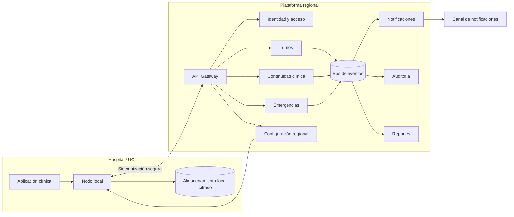

# Arquitectura de Software Seleccionada

## Decisión

Se selecciona una **arquitectura distribuida de microservicios orientada a eventos, desplegada por
regiones y con un nodo local por hospital (offline-first)**.

La arquitectura combina tres decisiones complementarias:

1. **Microservicios por capacidad de negocio:** turnos, continuidad clínica, emergencias,
   notificaciones, acceso, auditoría, reportes y configuración pueden evolucionar y escalar de forma
   independiente.
2. **Comunicación orientada a eventos:** los cambios clínicos, alertas y modificaciones de turnos se
   publican como eventos para informar a varios destinatarios sin acoplar todos los servicios.
3. **Procesamiento local por hospital:** un nodo local conserva las funciones clínicas prioritarias
   cuando se pierde la conexión regional y sincroniza los registros cuando esta regresa.

No se propone crear un microservicio por cada entidad. Los límites deben corresponder a capacidades
de negocio con necesidades diferentes de disponibilidad, seguridad o escalamiento.

## Justificación

Esta arquitectura es adecuada porque el sistema debe:

- mantener disponibles el handoff y las alertas aunque falle un componente o una sede pierda Internet;
- entregar alertas críticas en menos de 2 segundos y avisar a responsables alternos a los 90 segundos;
- crecer desde 1,000 hasta 10,000,000 de hospitales sin escalar todos los módulos por igual;
- conservar una bitácora inalterable de acciones y accesos clínicos;
- procesar notificaciones para varios destinatarios sin bloquear el registro clínico;
- aislar una falla regional para que no detenga todas las UCI;
- desplegar cambios de manera gradual sin interrumpir el servicio clínico.

Un monolito facilitaría el desarrollo inicial, pero concentraría el impacto de las fallas y obligaría a
escalar conjuntamente módulos con cargas muy distintas. Una arquitectura de microservicios únicamente
síncrona tampoco resolvería bien las notificaciones múltiples, la auditoría ni la desconexión de las
sedes. Por ello se incorpora comunicación asíncrona y capacidad local.

## Vista general

## Componentes y responsabilidades

| Componente | Responsabilidad principal | Requerimientos relacionados |
| --- | --- | --- |
| API Gateway | Punto de entrada, validación inicial, límites de consumo y enrutamiento regional | `RNF-SEG-01`, `RNF-ESC-01/02/03` |
| Identidad y acceso | Autenticación, roles, relación asistencial, segundo factor y vigencia de sesiones | `RF-ACC-01`, `RNF-SEG-01/02` |
| Servicio de turnos | Asignaciones, detección de cruces y responsables vigentes y alternos | `RF-TUR-01` |
| Servicio de continuidad clínica | Handoffs, diagnóstico vigente, versiones, prioridades y pendientes | `RF-DIA-01/02`, `RNF-PER-03` |
| Servicio de emergencias | Creación, estado y temporizador de aviso a responsables alternos | `RF-EME-01/02`, `RF-NOT-02` |
| Servicio de notificaciones | Selección de destinatarios y entrega por canales disponibles | `RF-NOT-01/02`, `RNF-OBS-01` |
| Nodo local hospitalario | Registro local cifrado, consulta clínica prioritaria y sincronización | `RF-CON-01`, `RNF-CON-01` |
| Configuración regional | Plantillas, parámetros, reglas y activación de sedes por lote | `RF-ADM-01`, `RNF-PER-02` |
| Auditoría | Registro inalterable de acciones, accesos y resultados | `RF-AUD-01` |
| Reportes | Indicadores por sede, servicio, turno y periodo | `RF-REP-01`, `RNF-OBS-02` |
| Bus de eventos | Distribución confiable de cambios clínicos, turnos y alertas | `RF-NOT-01`, `RNF-OBS-01`, `RNF-ESC-01/02/03` |

Cada servicio es propietario de sus datos. Ningún servicio modifica directamente la base de datos de
otro; la coordinación ocurre mediante APIs y eventos versionados.

## Flujos críticos

### Cambio de turno

1. El médico registra el handoff en el servicio de continuidad clínica.
2. El servicio valida los campos obligatorios, guarda una nueva versión y publica el evento
   `HandoffRegistrado`.
3. Auditoría conserva la evidencia y reportes actualiza sus indicadores.
4. El equipo entrante consulta el último handoff y su historial desde una vista ordenada por prioridad.

La información que ya exista en la historia clínica debe reutilizarse mediante una integración, en
lugar de exigir que el médico la escriba nuevamente. Cada acción o resultado pendiente debe tener
responsable, estado y vencimiento.

### Emergencia nocturna

1. La enfermera crea una alerta desde la aplicación clínica en un máximo de dos acciones.
2. Emergencias consulta en Turnos al responsable vigente, guarda la alerta y publica
   `AlertaCriticaCreada`.
3. Notificaciones entrega el aviso y publica los cambios de estado: entregada, leída o respondida.
4. Si no existe confirmación en 90 segundos, Emergencias publica `AlertaEscalada` para avisar al
   alterno y al jefe de guardia.
5. Auditoría registra cada intento y Reportes calcula los tiempos correspondientes.

El temporizador de escalamiento pertenece al servicio de emergencias y no al dispositivo de la
enfermera, para que continúe funcionando si la aplicación se cierra.

### Pérdida de conexión

1. El nodo local cambia visiblemente el estado de la aplicación a «sin conexión».
2. Los signos y eventos se guardan cifrados con identificador único, autor y hora original.
3. Al regresar la conexión, el nodo envía las operaciones pendientes de forma idempotente para evitar
   duplicados.
4. Si el mismo dato fue modificado local y regionalmente, el sistema no sobrescribe silenciosamente:
   conserva ambas versiones y solicita revisión a un rol clínico autorizado.

## Datos y consistencia

- **Consistencia fuerte:** asignación de turnos, permisos, creación de alertas y registro de una versión
  de handoff dentro del servicio propietario.
- **Consistencia eventual:** tableros, reportes, auditoría derivada y distribución de notificaciones.
- **Entrega de eventos:** patrón de salida transaccional para no guardar un cambio sin publicar su
  evento asociado.
- **Duplicados:** consumidores idempotentes e identificadores únicos por operación.
- **Trazabilidad:** eventos con sede, paciente, actor, fecha, versión y correlación del flujo.
- **Conflictos sin conexión:** conservación de versiones y revisión clínica; no se aplica automáticamente
  «el último cambio gana» a información clínica.

## Disponibilidad y escalamiento

- Despliegue regional en varias zonas de disponibilidad para evitar un único punto de falla.
- Réplicas y escalamiento independiente para emergencias, notificaciones y consultas clínicas.
- Particionamiento por región y sede para distribuir carga y limitar el impacto de una falla.
- Nodo local capaz de mantener las funciones prioritarias durante al menos 30 minutos sin conexión.
- Reintentos con espera incremental, límites de tiempo y aislamiento temporal de dependencias fallidas.
- Despliegues graduales con verificación de salud y reversión automática, sin detener todas las sedes.
- Pruebas periódicas de carga, recuperación regional y pérdida de conectividad bajo los perfiles de
  `RNF-ESC-01/02/03`.

La meta de 10 millones de hospitales debe validarse con datos reales del piloto. La arquitectura
permite distribuir la carga, pero no sustituye las pruebas de capacidad exigidas por los RNF.

## Seguridad y privacidad

- Cifrado en tránsito y en reposo, incluido el almacenamiento del nodo local.
- Acceso de mínimo privilegio por rol, turno y relación asistencial vigente.
- Segundo factor para cuentas administrativas.
- Auditoría de lecturas, modificaciones, intentos denegados y sincronizaciones.
- Datos del paciente separados por sede y región, con acceso entre regiones solo cuando exista una
  autorización explícita.
- Resúmenes familiares generados por personal autorizado, con contenido limitado, lenguaje
  comprensible y registro de cada publicación y consulta.

## Observabilidad

La plataforma debe correlacionar una operación desde el dispositivo hasta el servicio y el evento
resultante. Los tableros deben mostrar disponibilidad, latencia, errores, colas pendientes, estado de
sincronización y alertas sin confirmar por sede, región, servicio y dependencia externa.

Los incidentes deben incluir impacto clínico, sedes afectadas y prioridad. Los indicadores de gestión
deben admitir umbrales y alertas tempranas cuando una sede se desvíe de las metas acordadas.

## Riesgos y mitigaciones

| Riesgo | Mitigación |
| --- | --- |
| Mayor complejidad operativa que un monolito | Mantener pocos servicios alineados con capacidades de negocio, automatizar despliegues y definir responsables claros |
| Eventos duplicados o fuera de orden | Consumidores idempotentes, versión por agregado y claves de partición por paciente o alerta |
| Información temporalmente distinta entre servicios | Definir qué servicio es la fuente oficial y mostrar el estado de sincronización |
| Conflictos de datos creados sin conexión | Conservar versiones, impedir sobrescritura silenciosa y solicitar revisión clínica |
| Caída del bus de eventos | Persistir eventos pendientes, usar reintentos controlados y operar localmente las funciones prioritarias |
| Crecimiento prematuro del número de servicios | Dividir un servicio solo cuando exista una necesidad comprobada de escala, disponibilidad o autonomía |

## Alternativas consideradas

| Alternativa | Decisión | Motivo |
| --- | --- | --- |
| Monolito en capas | No seleccionada | Simplifica el inicio, pero concentra fallos y obliga a escalar conjuntamente cargas clínicas, reportes y notificaciones |
| Monolito modular | No seleccionada como arquitectura final | Puede servir para un prototipo, pero las metas iniciales y nacionales requieren aislamiento regional y escalamiento independiente |
| Microservicios solo con llamadas síncronas | No seleccionada | Aumenta el acoplamiento y propaga fallos durante alertas, auditoría y reportes |
| Arquitectura totalmente centralizada | No seleccionada | No mantiene el registro clínico cuando una sede pierde conectividad |
| Microservicios orientados a eventos con nodo local | **Seleccionada** | Equilibra escalamiento, aislamiento de fallos, tiempo real, trazabilidad y continuidad sin conexión |

## Decisiones pendientes antes de implementar

La arquitectura define la estructura de la solución, pero todavía deben acordarse estas reglas de
negocio identificadas en la quinta evaluación:

1. Catálogo versionado de eventos clínicos críticos.
2. Responsable y vencimiento de resultados y acciones pendientes.
3. Política completa de revisión de conflictos creados sin conexión.
4. Periodicidad y umbrales de los reportes institucionales.
5. Responsable, frecuencia y contenido mínimo del resumen para el familiar autorizado.

## Conclusión

La arquitectura seleccionada permite que cada hospital continúe con las funciones clínicas
prioritarias durante una desconexión, que las emergencias se procesen sin depender de un flujo
síncrono largo y que la plataforma escale por región y capacidad. Su complejidad adicional se
justifica por la criticidad de la UCI, las metas de disponibilidad y el crecimiento esperado, siempre
que se mantengan límites de servicio claros y se validen las capacidades mediante pruebas.
