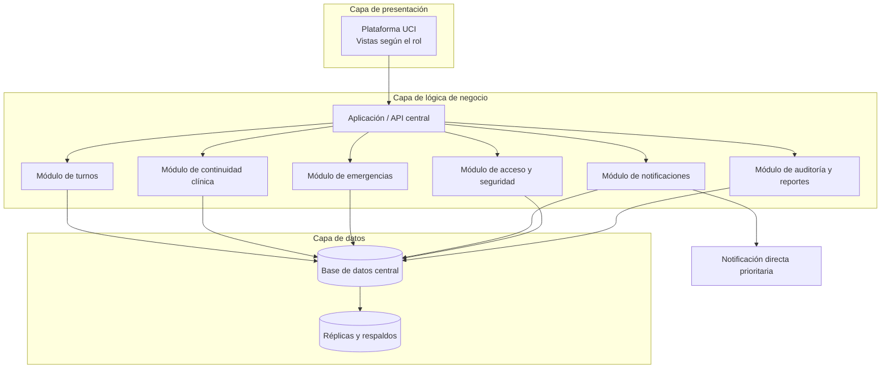

# Arquitectura de Software Seleccionada

## Decisión

Se selecciona una **arquitectura 3-tier (tres capas)** para la plataforma de gestión de UCI.

La solución se divide en:

1. **Capa de presentación:** una sola plataforma con vistas y permisos adaptados para médicos, enfermeras, administradores y responsables de gestión.
2. **Capa de lógica de negocio:** reglas de turnos, handoff, emergencias, notificaciones, permisos, auditoría y reportes.
3. **Capa de datos:** una base de datos lógica central que conserva la información clínica y operativa de forma consistente.

Esta arquitectura ofrece la separación necesaria sin introducir microservicios, múltiples bases de datos ni una cola general de eventos que complique innecesariamente el sistema.

## Por qué 3-tier es la opción adecuada

El caso presenta varios tipos de usuarios, pero todos trabajan sobre un mismo proceso integrado de atención UCI: turnos, continuidad clínica y emergencias. No existen áreas de negocio suficientemente independientes que necesiten desplegarse y almacenar sus datos por separado.

3-tier permite:

- mantener una única fuente de información para diagnósticos, handoffs, turnos y alertas;
- aplicar las reglas clínicas y de seguridad en un solo nivel de negocio;
- evitar inconsistencias entre bases de datos distribuidas;
- procesar una emergencia mediante una ruta directa, sin esperar detrás de eventos informativos;
- desplegar y operar una solución más sencilla para el piloto;
- escalar los servidores de aplicación sin dividir prematuramente el sistema;
- probar la lógica de negocio sin depender de la interfaz de usuario.

## Vista general

## Responsabilidades por capa

### Capa de presentación

- La misma plataforma muestra pacientes, handoffs, turnos, alertas, administración o reportes según el rol autenticado.
- Permite crear una alerta crítica en un máximo de dos acciones.
- Guarda temporalmente signos y eventos en el dispositivo cuando no existe conexión.
- Informa si un dato está guardado, pendiente de sincronización o confirmado.
- No decide destinatarios ni ejecuta el escalamiento de emergencias.

### Capa de lógica de negocio

- Valida turnos y rechaza solapamientos.
- Exige los campos obligatorios del handoff y conserva sus versiones.
- Determina el médico responsable y los responsables alternos.
- Registra la alerta antes de enviarla y controla el plazo de 90 segundos.
- Envía las alertas críticas por una ruta de ejecución prioritaria.
- Autoriza el acceso según rol, turno y relación asistencial.
- Produce la auditoría y los indicadores institucionales.
- Recibe y valida los registros creados sin conexión.

Los módulos pertenecen a la misma aplicación y pueden compartir una transacción cuando una operación crítica lo requiera. La separación es lógica, no implica servicios independientes.

### Capa de datos

- Mantiene una base de datos lógica central como fuente oficial.
- Relaciona pacientes, turnos, handoffs, alertas, usuarios y auditoría.
- Aplica transacciones para evitar estados parciales.
- Conserva versiones y evita sobrescrituras silenciosas.
- Utiliza réplicas, respaldos y recuperación para cumplir disponibilidad y RTO.
- Puede particionar datos por región o sede al crecer sin cambiar a microservicios.

## Tratamiento de alertas críticas

Las alertas de emergencia **no se colocan en una cola FIFO compartida** con reportes, cambios informativos u otras tareas. Una emergencia no debe convertirse en el octavo elemento detrás de eventos menos importantes.

El flujo será directo:

1. La enfermera registra la alerta mediante la API.
2. La capa de negocio valida al paciente y consulta el turno vigente.
3. La alerta se guarda en la misma operación con estado `creada`.
4. El módulo de notificaciones inicia inmediatamente el envío al responsable.
5. Un temporizador controlado por la capa de negocio verifica la confirmación.
6. Si nadie confirma en 90 segundos, se avisa directamente al alterno y al jefe de guardia.
7. Cada cambio de estado se guarda para auditoría y seguimiento.

Las alertas críticas tienen recursos de ejecución reservados, prioridad superior y límites de tiempo. Los reportes y tareas administrativas se ejecutan con menor prioridad y nunca deben bloquear este flujo.

## Funcionamiento sin conexión

La arquitectura continúa siendo 3-tier aunque la plataforma utilizada desde la tablet junto al paciente conserve temporalmente datos locales:

1. La capa de presentación guarda el registro cifrado con identificador, autor y hora.
2. La interfaz muestra que está pendiente de sincronización.
3. Al regresar la conexión, la aplicación lo envía a la capa de negocio.
4. La lógica valida duplicados y conflictos antes de escribir en la base central.
5. Ante un conflicto clínico, se conservan las versiones y se solicita revisión autorizada.

El almacenamiento temporal del dispositivo no es una segunda base de datos institucional ni una fuente oficial; solo permite continuar el trabajo durante la desconexión exigida por `RF-CON-01`.

## Relación con los requerimientos

| Necesidad | Solución en 3-tier | Requerimientos |
| --- | --- | --- |
| Turnos sin cruces | Validación central en la capa de negocio | `RF-TUR-01` |
| Handoff completo y versionado | Módulo clínico y transacciones sobre la base central | `RF-DIA-01/02`, `RNF-PER-03` |
| Emergencia inmediata | Ruta directa y prioritaria en la capa de negocio | `RF-EME-01/02`, `RNF-OBS-01` |
| Notificaciones focalizadas | Selección central del destinatario según paciente y turno | `RF-NOT-01/02` |
| Trabajo sin conexión | Almacenamiento temporal en presentación y sincronización validada | `RF-CON-01`, `RNF-CON-01` |
| Seguridad | Autorización central y protección de datos | `RF-ACC-01`, `RNF-SEG-01/02` |
| Auditoría y reportes | Registro central consistente y consultas institucionales | `RF-AUD-01`, `RF-REP-01` |
| Disponibilidad y recuperación | Varias instancias de aplicación, réplica y respaldo de datos | `RNF-DIS-01/02/03` |
| Crecimiento | Escalamiento horizontal de la capa de negocio y partición de datos | `RNF-ESC-01/02/03` |

## Disponibilidad y escalamiento

3-tier no significa que exista un único servidor físico. La misma aplicación puede ejecutarse en varias instancias detrás de un balanceador de carga.

- La capa de presentación puede distribuirse como aplicación web y móvil.
- La capa de negocio se replica horizontalmente y mantiene las sesiones fuera de cada instancia.
- La base de datos utiliza alta disponibilidad, réplicas de lectura y respaldos verificados.
- Los datos pueden particionarse por región o sede si el volumen lo exige.
- Los despliegues se realizan gradualmente entre instancias para mantener el servicio disponible.
- La capacidad debe comprobarse con las pruebas de `RNF-ESC-01/02/03`.

La meta de diez millones de hospitales debe validarse con datos reales. Si las pruebas futuras demuestran que una capacidad concreta necesita independencia, podrá separarse posteriormente; no es necesario asumir esa complejidad en el piloto.

## Seguridad

- Autenticación y autorización centralizadas en la capa de negocio.
- Acceso de mínimo privilegio según rol, turno y relación asistencial.
- Segundo factor para administradores.
- Cifrado en tránsito, en reposo y en el almacenamiento temporal del dispositivo.
- Auditoría de lecturas, cambios, intentos denegados y sincronizaciones.
- Consultas parametrizadas y validación de todas las entradas.

## Riesgos y mitigaciones

| Riesgo | Mitigación |
| --- | --- |
| La aplicación central se vuelve demasiado grande | Mantener módulos internos con responsabilidades e interfaces claras |
| Una tarea administrativa consume recursos clínicos | Reservar capacidad y prioridad para alertas y operaciones clínicas |
| La base de datos se convierte en cuello de botella | Índices, réplicas de lectura, partición por sede o región y pruebas de carga |
| Una caída afecta a varias funciones | Varias instancias, aislamiento interno, control de fallos y recuperación probada |
| Conflictos después de trabajar sin conexión | Identificadores únicos, control de versiones y revisión clínica |

## Comparación de las cuatro opciones

| Arquitectura | Evaluación para este caso |
| --- | --- |
| **3-tier** | **Seleccionada.** Separa interfaz, negocio y datos sin distribuir innecesariamente las reglas ni la información clínica. |
| Hexagonal | Útil para aislar la lógica de tecnologías externas, pero por sí sola no define el despliegue, la disponibilidad ni la separación física del sistema solicitada en este análisis. |
| Event-driven | No seleccionada como arquitectura principal porque una cola general añade complejidad y puede retrasar una emergencia si no existe priorización estricta. |
| Microservicios | No seleccionada porque no hay capacidades de negocio con autonomía suficiente que justifiquen múltiples despliegues y bases de datos. |

## Decisiones pendientes

Antes de implementar todavía deben definirse:

1. Catálogo de eventos clínicos considerados críticos.
2. Responsable y vencimiento de las acciones pendientes del handoff.
3. Política de revisión de conflictos generados sin conexión.
4. Periodicidad de los reportes institucionales.
5. Contenido mínimo y responsable del resumen familiar.

## Conclusión

La arquitectura **3-tier** resuelve el caso con menor complejidad y una fuente de datos consistente. La capa de presentación atiende a los distintos usuarios, la capa de negocio concentra las reglas de UCI y la capa de datos conserva la trazabilidad. Las emergencias utilizan un camino directo y prioritario, sin depender de una cola general, mientras que la replicación de la aplicación y de los datos permite mejorar disponibilidad y capacidad sin introducir microservicios prematuramente.
