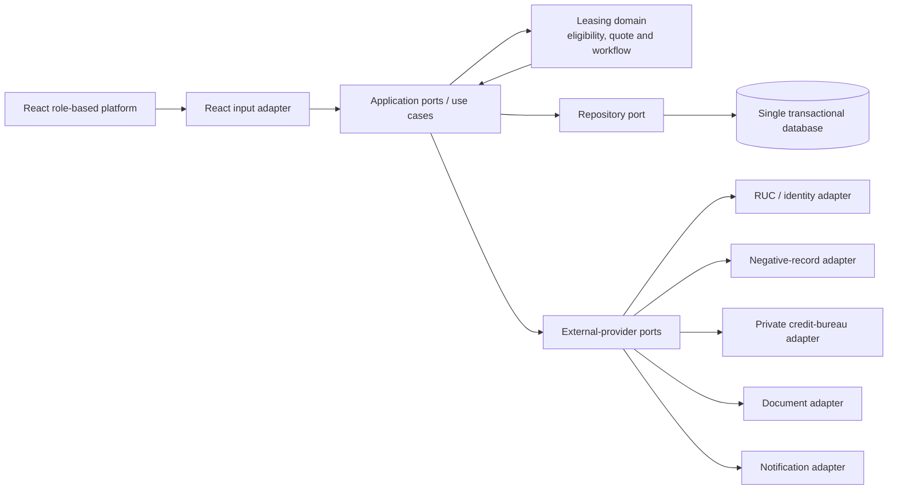

# Selected Software Architecture

## Decision

Select a **hexagonal architecture (ports and adapters) implemented as one modular application with one transactional database**.

The leasing rules form one cohesive domain, so microservices and multiple databases are not justified. However, the production system will interact with replaceable external capabilities such as RUC validation, credit information, document storage, signatures, notifications and supplier systems. Hexagonal architecture keeps these technologies outside the leasing core and lets the POC use in-memory adapters without changing its use cases.

## Structure

## Inside the hexagon

- Lease application and status-transition rules.
- Preliminary quote calculation.
- Explainable eligibility policy.
- Quote acceptance and idempotency rules.
- Evidence validation and analyst-decision rules.
- Ordered negative-record and credit-behavior rules with short-circuit evaluation.
- Credit-to-operations handoff and delivery-scheduling rules.
- Role-independent business validation.

The domain does not know HTTP, a database engine, a credit provider or a UI framework.

## Ports

| Port | Purpose |
| --- | --- |
| Submit application | Validate input and create a preliminary decision |
| Accept quote | Move one pre-approved application to formal review once |
| Review application | Record evidence and analyst decision |
| Coordinate approved application | Record supplier, contract reference and delivery date |
| Track operations | Query owner, status, progress and next action |
| Application repository | Save and retrieve the current aggregate and versions |
| Company verification | Obtain authorized RUC and identity evidence |
| Negative-record lookup | Check a blocking source before requesting private-bureau behavior |
| Credit behavior | Obtain authorized score, overdue-debt and payment-behavior evidence only after a clear negative-record result |
| Document storage | Store evidence without coupling the domain to a vendor |
| Notification | Inform users after committed state changes |

## Adapters

- React input adapter for the POC; an HTTP API adapter may be added for the pilot.
- In-memory repository for the POC.
- Transactional database repository for the pilot.
- Deterministic negative-record and Equifax-like credit-bureau adapters for the POC.
- Provider-specific authorized negative-record, SBS/private-bureau, document and notification adapters for production.

## End-to-end happy-path flow

1. The React adapter receives Pedro's request and invokes the application use case.
2. The use case validates required fields and asks the domain policy for a decision.
3. The domain calculates the quote and returns rule-by-rule evidence.
4. The repository port stores the application atomically.
5. React renders the preliminary quote returned by the use case.
6. Quote acceptance invokes a separate idempotent use case and moves the same application to `FORMAL_REVIEW`.
7. Carlos's React view reads that same application, displays the policy evidence and requires the three simulated evidence items plus a decision reason.
8. The application service calls the negative-record port first. A match creates `CREDIT_REJECTED` and the credit-bureau port is not called.
9. For a clear RUC, the service calls the credit-behavior port and the domain evaluates score, overdue debt and recent late payments under a versioned policy.
10. A fully passing decision moves the aggregate to `CREDIT_APPROVED`, assigns it to Julia and appends source, policy and rule results to the case.
11. Julia's React view reuses the approved applicant, machinery and quote data and records the supplier, contract reference and delivery date.
12. The aggregate moves to `DELIVERY_SCHEDULED`; Pedro can see the formal decision, delivery information and complete progress without re-entering data.

The core flow is synchronous because the applicant needs an immediate result. A general event queue is not required for the POC. Non-critical notifications may be asynchronous later, but they cannot become the source of truth for the lease decision.

## Data decision

Use one transactional database for applicants, applications, quotes, decisions, evidence metadata and audit references. A shared process and strong consistency requirements are more important than independent data ownership in this case.

Document binaries may use a dedicated document store in production, accessed through a port; their metadata and workflow state remain referenced by the transactional record.

## Quality-attribute mapping

| Attribute | Architectural response | Requirements |
| --- | --- | --- |
| Explainability | Domain policies return each rule result, source, value and version, including `NOT_EVALUATED` after short-circuit | `FR-RSK-01/03/04`, `FR-DEC-01` |
| Consistency | One aggregate transition and transactional repository | `FR-QUO-02`, `FR-OPS-03`, `NFR-REL-01` |
| Replaceability | External systems accessed only through ports | Production gaps 1–2 |
| Security and privacy | Authentication/authorization at the use-case boundary plus authorized-purpose validation before provider calls | `FR-ACC-01`, `NFR-SEC-01/02/03` |
| Performance | Direct synchronous use case; horizontally replicated stateless app | `NFR-PER-01/02` |
| Recovery | Replicated application and database backup/restore | `NFR-AVL-01`, `NFR-REC-01` |
| Auditability | Append-only audit adapter after validated business actions | `FR-AUD-01`, `NFR-AUD-01` |
| Provider resilience | Map timeout/error to technical review, never to an adverse record | `NFR-REL-02` |
| Provider observability | Record source, timing, outcome, correlation and short-circuit without logging full reports | `NFR-OBS-02` |

## Comparison of alternatives

| Alternative | Decision for Lab 2 |
| --- | --- |
| 3-tier | Viable, but a conventional dependency direction may couple leasing rules to database and provider details unless additional discipline is introduced. |
| **Hexagonal** | **Selected.** Protects quote and eligibility rules from changing external providers and lets the POC replace them with controlled adapters. |
| Event-driven | Not selected as the primary architecture; the happy path needs an immediate decision and does not require a general event queue. |
| Microservices | Not selected; the initial domain, team and data do not justify independent deployment or databases. |

## Risks and mitigations

| Risk | Mitigation |
| --- | --- |
| Ports created for integrations that never arrive | Add a port only for a demonstrated external boundary or test substitution |
| Domain objects become simple data containers | Keep eligibility, calculation and transition invariants inside the domain |
| One application grows without internal boundaries | Organize modules by use case and enforce dependency direction |
| Database becomes a bottleneck | Measure first, then index, add read replicas or partition without changing domain ports |
| POC policy mistaken for real credit policy | Label every result preliminary and keep the policy version explicit |
| Negative-record hit still triggers a paid/private query | Enforce ordering in the application service and test that the bureau adapter query count does not change |
| Provider error mistaken for adverse credit information | In the pilot, represent timeout/unavailability as a technical-review state, never as a negative record |
| Arbitrary or discriminatory thresholds | Require risk-owner, legal and fairness validation before using any rule with real applicants |

## Scope statement

The POC demonstrates submit, evaluate, quote, accept, evidence validation, ordered risk-provider calls, formal approval/rejection and delivery scheduling through one modular application and one in-memory repository. Its negative-record and Equifax-like adapters return deterministic test data and prove short-circuit behavior; they do not access real external information. Its Pedro, Carlos and Julia views simulate role handoffs but do not implement authentication or authorization. It does not prove document authenticity, regulatory compliance, fairness, real credit quality, binding contracting, supplier integration, physical delivery, external-provider reliability or production capacity.
