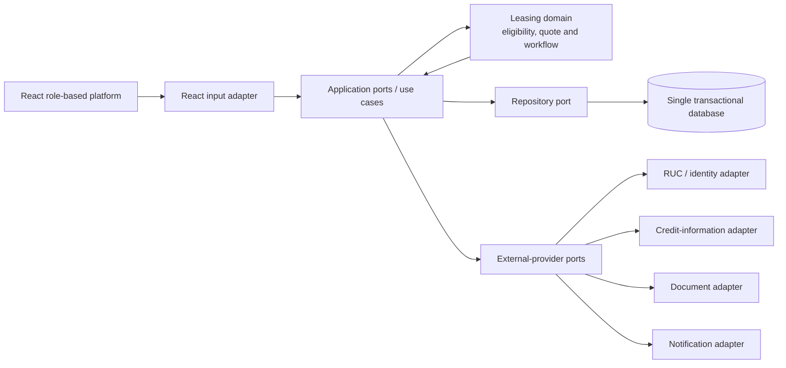

# Selected Software Architecture

## Decision

Select a **hexagonal architecture (ports and adapters) implemented as one modular application with one transactional database**.

The leasing rules form one cohesive domain, so microservices and multiple databases are not justified. However, the production system will interact with replaceable external capabilities such as RUC validation, credit information, document storage, signatures, notifications and supplier systems. Hexagonal architecture keeps these technologies outside the leasing core and lets the POC use in-memory adapters without changing its use cases.

## Structure

## Inside the hexagon

- Lease application and status-transition rules.
- Preliminary quote calculation.
- Explainable eligibility policy.
- Quote acceptance and idempotency rules.
- Evidence and analyst-decision use cases.
- Role-independent business validation.

The domain does not know HTTP, a database engine, a credit provider or a UI framework.

## Ports

| Port | Purpose |
| --- | --- |
| Submit application | Validate input and create a preliminary decision |
| Accept quote | Move one pre-approved application to formal review once |
| Review application | Record evidence and analyst decision |
| Track operations | Query owner, status, age and next action |
| Application repository | Save and retrieve the current aggregate and versions |
| Company verification | Obtain authorized RUC and identity evidence |
| Credit information | Obtain authorized external risk evidence |
| Document storage | Store evidence without coupling the domain to a vendor |
| Notification | Inform users after committed state changes |

## Adapters

- React input adapter for the POC; an HTTP API adapter may be added for the pilot.
- In-memory repository for the POC.
- Transactional database repository for the pilot.
- Provider-specific RUC, credit, document and notification adapters for production.

## Critical happy-path flow

1. The React adapter receives Pedro's request and invokes the application use case.
2. The use case validates required fields and asks the domain policy for a decision.
3. The domain calculates the quote and returns rule-by-rule evidence.
4. The repository port stores the application atomically.
5. React renders the preliminary quote returned by the use case.
6. Quote acceptance invokes a separate idempotent use case and moves the same application to `FORMAL_REVIEW`.

The core flow is synchronous because the applicant needs an immediate result. A general event queue is not required for the POC. Non-critical notifications may be asynchronous later, but they cannot become the source of truth for the lease decision.

## Data decision

Use one transactional database for applicants, applications, quotes, decisions, evidence metadata and audit references. A shared process and strong consistency requirements are more important than independent data ownership in this case.

Document binaries may use a dedicated document store in production, accessed through a port; their metadata and workflow state remain referenced by the transactional record.

## Quality-attribute mapping

| Attribute | Architectural response | Requirements |
| --- | --- | --- |
| Explainability | Domain policy returns each rule result and version | `FR-RSK-01`, `FR-DEC-01` |
| Consistency | One aggregate transition and transactional repository | `FR-QUO-02`, `FR-OPS-03`, `NFR-REL-01` |
| Replaceability | External systems accessed only through ports | Production gaps 1–2 |
| Security | Authentication adapter plus authorization at use-case boundary | `FR-ACC-01`, `NFR-SEC-01/02` |
| Performance | Direct synchronous use case; horizontally replicated stateless app | `NFR-PER-01/02` |
| Recovery | Replicated application and database backup/restore | `NFR-AVL-01`, `NFR-REC-01` |
| Auditability | Append-only audit adapter after validated business actions | `FR-AUD-01`, `NFR-AUD-01` |

## Comparison of alternatives

| Alternative | Decision for Lab 2 |
| --- | --- |
| 3-tier | Viable, but a conventional dependency direction may couple leasing rules to database and provider details unless additional discipline is introduced. |
| **Hexagonal** | **Selected.** Protects quote and eligibility rules from changing external providers and lets the POC replace them with controlled adapters. |
| Event-driven | Not selected as the primary architecture; the happy path needs an immediate decision and does not require a general event queue. |
| Microservices | Not selected; the initial domain, team and data do not justify independent deployment or databases. |

## Risks and mitigations

| Risk | Mitigation |
| --- | --- |
| Ports created for integrations that never arrive | Add a port only for a demonstrated external boundary or test substitution |
| Domain objects become simple data containers | Keep eligibility, calculation and transition invariants inside the domain |
| One application grows without internal boundaries | Organize modules by use case and enforce dependency direction |
| Database becomes a bottleneck | Measure first, then index, add read replicas or partition without changing domain ports |
| POC policy mistaken for real credit policy | Label every result preliminary and keep the policy version explicit |

## Scope statement

The POC demonstrates submit, evaluate, quote and accept through the same ports that a production adapter could call. It does not prove regulatory compliance, real credit quality, external-provider reliability or production capacity.
