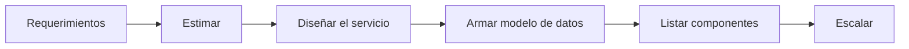
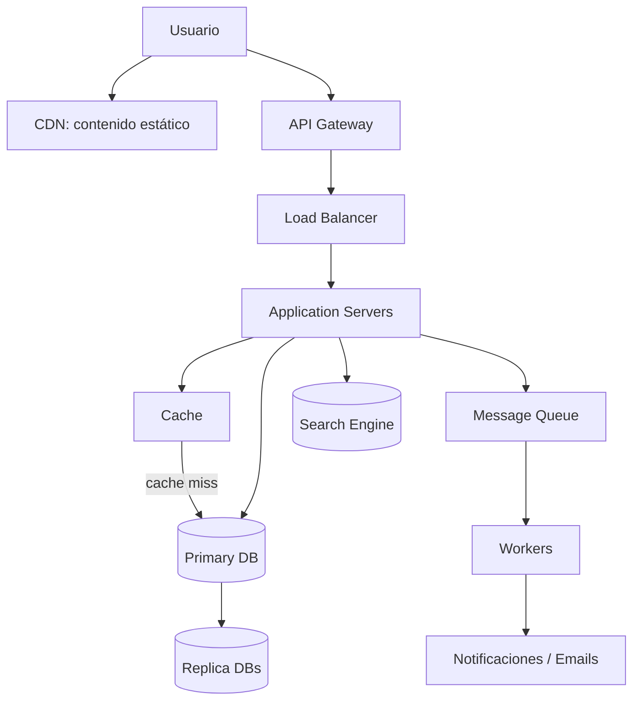

# Framework R.E.D.A.L.E. para diseñar una arquitectura desde cero

> **Idea principal:** una arquitectura de software no debe diseñarse empezando por tecnologías o diagramas. Primero se entiende el problema y sus requerimientos; después se estima la carga; luego se decide qué servicios, datos y componentes se necesitan; finalmente se adapta la arquitectura cuando la carga crece. El framework **R.E.D.A.L.E.** convierte ese proceso en una secuencia ordenada y repetible.

**Material base:** *A Framework to Build an Architecture from Zero* — Carlos Balbuena, UTEC, 2026-II.

---

## Índice

1. [¿Qué es R.E.D.A.L.E.?](#1-qué-es-redale)
2. [Resumen rápido del framework](#2-resumen-rápido-del-framework)
3. [R — Requerimientos](#3-r--requerimientos)
4. [E — Estimar](#4-e--estimar)
   1. [Estimación de servidores](#41-estimación-de-servidores)
   2. [Estimación de almacenamiento](#42-estimación-de-almacenamiento)
   3. [Estimación de ancho de banda](#43-estimación-de-ancho-de-banda)
5. [D — Diseñar el servicio](#5-d--diseñar-el-servicio)
   1. [Patrones arquitectónicos](#51-patrones-arquitectónicos)
   2. [Diseño de API](#52-diseño-de-api)
6. [A — Armar el modelo de datos](#6-a--armar-el-modelo-de-datos)
7. [L — Listar los componentes](#7-l--listar-los-componentes)
   1. [Building blocks esenciales](#71-building-blocks-esenciales)
   2. [Flujo típico de una arquitectura](#72-flujo-típico-de-una-arquitectura)
8. [E — Escalar](#8-e--escalar)
   1. [Escalamiento por nivel de carga](#81-escalamiento-por-nivel-de-carga)
   2. [Escalamiento horizontal y vertical](#82-escalamiento-horizontal-y-vertical)
9. [Caso de estudio: X, antes Twitter](#9-caso-de-estudio-x-antes-twitter)
10. [Caso de estudio: Paper.ly](#10-caso-de-estudio-paperly)
11. [Plantilla práctica para aplicar R.E.D.A.L.E.](#11-plantilla-práctica-para-aplicar-redale)
12. [Ideas que debes recordar](#12-ideas-que-debes-recordar)
13. [Observaciones e inconsistencias del material](#13-observaciones-e-inconsistencias-del-material)

---

## 1. ¿Qué es R.E.D.A.L.E.?

**R.E.D.A.L.E.** es un framework para abordar problemas de **system design** de forma ordenada. Sirve tanto para entrevistas técnicas como para el trabajo real de arquitectura de software.

La idea que motiva el framework es:

> Diseñar una arquitectura sin un método es como construir un edificio sin planos.

El método obliga a responder primero **qué problema se resuelve**, **para quién**, **con qué restricciones** y **con qué volumen de carga**, antes de dibujar componentes o elegir tecnologías.

El framework se inspira en *The System Design Interview*, de Lewis C. Lin y Shivam P. Patel.

---

## 2. Resumen rápido del framework

| Letra | Paso | Pregunta principal | Resultado esperado |
|---|---|---|---|
| **R** | Requerimientos | ¿Qué debe hacer el sistema y bajo qué restricciones? | Lista de requerimientos funcionales y no funcionales |
| **E** | Estimar | ¿Cuánta carga, almacenamiento y tráfico debe soportar? | Cálculos aproximados de capacidad |
| **D** | Diseñar el servicio | ¿Qué arquitectura, persistencia y API se usarán? | Diseño de alto nivel y alcance del servicio |
| **A** | Armar el modelo de datos | ¿Qué datos existen y cómo se almacenan? | Tablas, objetos, campos y estrategias de almacenamiento |
| **L** | Listar los componentes | ¿Qué bloques forman la solución y cómo se conectan? | Diagrama de arquitectura base |
| **E** | Escalar | ¿Qué cambia si crece la carga o aparece un cuello de botella? | Evolución de la arquitectura según la demanda |



---

## 3. R — Requerimientos

La fase de requerimientos consiste en preguntar todo lo necesario para comprender **qué se está resolviendo**.

### Preguntas esenciales

- ¿Tenemos claro el problema o los problemas?
- ¿Para quién estamos resolviendo el problema?
- ¿Cuáles son las limitaciones?
- ¿Qué funciones debe ofrecer el sistema?
- ¿Qué nivel de disponibilidad, rendimiento, seguridad o capacidad se espera?

### Realidad del trabajo

Los requerimientos poco claros y ambiguos son parte normal del trabajo en ingeniería de software. No se debe asumir que siempre se recibirá un documento perfecto y listo para diseñar o programar.

El arquitecto debe:

1. Hacer preguntas.
2. Detectar ambigüedades.
3. Precisar el alcance.
4. Separar necesidades funcionales de restricciones de calidad.
5. Confirmar supuestos con las partes interesadas.

### Salida de esta fase

Una lista o backlog de:

- **Requerimientos funcionales:** acciones que el sistema debe permitir.
- **Requerimientos no funcionales:** condiciones de calidad y operación que el sistema debe cumplir.

### Ejemplos

**Funcionales:**

- Registrar usuarios.
- Publicar contenido.
- Buscar información.
- Dar “like”.
- Generar un timeline.

**No funcionales:**

- Soportar 100 millones de usuarios concurrentes.
- Almacenar 10 exabytes de fotos.
- Procesar 1 millón de transacciones por hora.

> **Regla:** antes de elegir microservicios, bases de datos o nubes, se debe saber exactamente qué problema se quiere resolver.

---

## 4. E — Estimar

En esta fase se calculan, de manera aproximada, las necesidades del sistema para que funcione adecuadamente y sin degradación.

Después de estimar la carga inicial, se determina cuántos recursos se necesitan y con qué capacidad.

### Entradas comunes

- Número total de usuarios.
- Número de usuarios activos.
- **RPS:** requests por segundo.
- Logins por segundo.
- Transacciones por segundo o por hora.
- Almacenamiento requerido.
- Datos de entrada y salida.

### Tres cálculos principales

1. Servidores requeridos.
2. Almacenamiento requerido.
3. Ancho de banda requerido.

---

### 4.1. Estimación de servidores

#### Procedimiento

1. Calcular cuántas solicitudes puede procesar un solo núcleo de CPU.
2. Calcular la capacidad de un servidor:

```text
Capacidad del servidor = número de cores × capacidad de un core
```

3. Calcular la cantidad de servidores:

```text
Número de servidores = RPS requerido / capacidad de un servidor
```

#### Ejemplo del material

- Un core procesa **5 requests/s**.
- Un servidor tiene **32 cores**.

```text
32 cores × 5 requests/s = 160 requests/s por servidor
```

El sistema debe soportar **100 000 requests/s**:

```text
100 000 / 160 = 625 servidores
```

**Resultado:** se necesitan aproximadamente **625 servidores**.

> La estimación no busca ser exacta al 100 %. Su objetivo es obtener un orden de magnitud que permita tomar decisiones de arquitectura.

---

### 4.2. Estimación de almacenamiento

#### Procedimiento

1. Identificar los diferentes tipos de datos.
2. Estimar el espacio que ocupa cada tipo.
3. Sumar el tamaño de una unidad lógica.
4. Multiplicar por la cantidad de unidades generadas durante el periodo analizado.

#### Ejemplo: almacenamiento diario similar a YouTube

##### Tipos de datos

- Videos.
- Imágenes miniatura o thumbnails.
- Comentarios.

##### Tamaño estimado por video

- Video de 10 minutos en 1080p: originalmente cerca de 4 GB.
- Después de compresión: aproximadamente **40 MB**.
- Thumbnail: aproximadamente **20 KB**.
- Comentarios: 5 comentarios promedio × 100 bytes = **500 bytes**.

El material aproxima el total a:

```text
40 MB por video
```

Si se cargan **1,3 millones de videos diarios**:

```text
1,3 millones × 40 MB ≈ 52 TB diarios
```

**Resultado aproximado:** **52 TB de almacenamiento por día**.

### Qué se debe considerar en un diseño real

Aunque no se desarrolla en profundidad en la presentación, esta estimación sirve como base para considerar posteriormente:

- Replicación.
- Copias de seguridad.
- Crecimiento histórico.
- Metadatos.
- Índices.
- Compresión.
- Políticas de retención.

---

### 4.3. Estimación de ancho de banda

El objetivo es determinar cuántos datos entran al sistema y cuántos datos se entregan a los usuarios durante un periodo.

#### Procedimiento

1. Determinar la cantidad de datos de entrada por día.
2. Determinar la cantidad de datos de salida por día.
3. Dividir entre los segundos del periodo para obtener una tasa por segundo.

```text
Segundos por día = 86 400
```

#### Ejemplo: entrada

Si el sistema recibe cerca de **52 TB diarios**:

```text
52 TB / 86 400 s ≈ 0,6 GB/s de subida
```

#### Ejemplo: salida

Supuestos:

- 100 millones de usuarios activos.
- Cada usuario reproduce 10 videos.
- Cada video ocupa 40 MB.

```text
100 M × 10 × 40 MB = 40 PB diarios de salida
```

La tasa aproximada es:

```text
40 PB / 86 400 s ≈ 460 GB/s de descarga
```

### Interpretación

El ejemplo evidencia que la carga de salida puede ser mucho mayor que la de entrada. Esto justifica el uso de elementos como:

- CDN.
- Cachés.
- Réplicas de lectura.
- Distribución geográfica.

---

## 5. D — Diseñar el servicio

En esta fase se define **qué se va a construir y cómo se construirá**, todavía a un nivel alto.

### Decisiones principales

- Tipo de arquitectura: monolito, 3-tier, microservicios, event-driven, etc.
- Tipo de persistencia: SQL, NoSQL o una combinación.
- Diseño de API.
- Alcance y expectativas de la arquitectura.
- Límites entre servicios o módulos.

### Ejemplo del material

Se plantea una aplicación que:

- Utiliza arquitectura **3-tier**.
- Empieza como **monolito**.
- No requiere conexión hacia sistemas externos.
- Usa **NoSQL para imágenes**.
- Usa **SQL para metadatos de usuarios**.

Posibles endpoints:

```text
/user
/receipts
/messages
/invoice
```

> En esta fase se decide la forma general de la solución; todavía no se necesita dibujar cada servidor físico.

---

### 5.1. Patrones arquitectónicos

| Patrón | Usarlo cuando... | Evitarlo cuando... |
|---|---|---|
| **Monolito** | Se construye un MVP, el equipo es pequeño —menos de 10 desarrolladores— y el dominio es poco claro todavía | Se necesita escalar partes del sistema de manera independiente |
| **3-tier** | Se requiere una separación clara entre interfaz, lógica y datos; funciona bien para aplicaciones web tradicionales | Existen decenas de equipos o dominios muy distintos |
| **Microservicios** | Hay equipos grandes, dominios bien definidos y necesidad de escalar servicios de forma diferenciada | El producto está en una etapa inicial y el overhead operacional sería demasiado alto |
| **Event-driven** | Existen workflows asíncronos, notificaciones o procesamiento por lotes | Todo requiere una respuesta síncrona e inmediata |

### Lectura correcta de la tabla

El patrón no se elige porque esté de moda. Se elige según:

- Tamaño del equipo.
- Madurez del dominio.
- Necesidad de despliegue independiente.
- Requerimientos de escalabilidad.
- Complejidad operacional aceptable.

---

### 5.2. Diseño de API

| Tipo | Características | Ideal para... |
|---|---|---|
| **REST** | Stateless, verbos HTTP como GET, POST, PUT y DELETE; normalmente JSON | CRUD estándar, APIs públicas y backends móviles |
| **GraphQL** | El cliente solicita exactamente los datos que necesita; normalmente usa un endpoint | Aplicaciones con muchos tipos de datos y frontends que cambian con frecuencia |
| **gRPC** | Protocolo binario basado en Protobuf, rápido y con tipado fuerte | Comunicación interna entre microservicios |
| **WebSocket** | Conexión persistente y bidireccional | Chat, notificaciones en tiempo real y gaming |

### Idea clave

El diseño de API debe responder a la forma de comunicación requerida. No todos los servicios necesitan REST, ni todos necesitan comunicación síncrona.

---

## 6. A — Armar el modelo de datos

En esta fase se define el modelo de datos utilizado por la arquitectura.

### Elementos que se deben precisar

- Tablas.
- Objetos o documentos.
- Campos.
- Relaciones.
- Claves primarias y foráneas.
- Base de datos elegida.
- Archivos, caché u otros sistemas de almacenamiento.

### Ejemplo SQL

**Tabla: `Video`**

Posibles campos:

- `title`
- `creationDate`
- `author`
- `category`
- `score`
- `comments` como relación o clave foránea

### Ejemplo NoSQL

```json
{
  "id": 1,
  "name": "Carlos",
  "email": "theemail@server.com"
}
```

### Otros tipos de almacenamiento

#### Sistemas de archivos distribuidos

Se usan para almacenar archivos distribuidos entre múltiples nodos. El material menciona **Hadoop** como referencia.

#### Object Storage

Se usa para almacenar archivos binarios grandes, como imágenes, videos o documentos. El material menciona **Amazon S3** como ejemplo.

### Idea clave

No todos los datos tienen la misma forma ni el mismo patrón de acceso. Una arquitectura puede combinar:

- SQL para relaciones y consistencia.
- NoSQL para documentos o acceso flexible.
- Object Storage para archivos grandes.
- Caché para datos consultados con frecuencia.
- Motores de búsqueda para consultas full-text.

---

## 7. L — Listar los componentes

En esta fase se diagrama la arquitectura utilizando todo lo definido anteriormente.

Aquí ya se deben mostrar:

- Usuarios o clientes.
- APIs.
- Servicios.
- Bases de datos.
- Cachés.
- Colas.
- Balanceadores.
- CDN.
- Motores de búsqueda.
- Flujos de lectura, escritura y procesamiento asíncrono.

El resultado es la **arquitectura base**.

---

### 7.1. Building blocks esenciales

| Componente | Qué hace | Cuándo usarlo |
|---|---|---|
| **Load Balancer** | Distribuye el tráfico entre varios servidores | Cuando existe más de un servidor de aplicación |
| **CDN** | Entrega contenido estático desde servidores cercanos al usuario | Imágenes, videos y assets que no cambian frecuentemente |
| **Cache, por ejemplo Redis** | Guarda datos en memoria para acceso muy rápido | Datos consultados con frecuencia, sesiones o queries costosas |
| **Message Queue** | Permite comunicación asíncrona entre servicios | Notificaciones, correos y procesamiento que puede esperar |
| **API Gateway** | Punto de entrada único; autenticación, rate limiting y routing | Microservicios o APIs públicas |
| **Primary/Replica DB** | La primaria recibe escrituras y las réplicas atienden lecturas | Cuando las lecturas superan ampliamente a las escrituras |
| **Search Engine** | Indexación y búsqueda full-text optimizada | Cuando SQL no resuelve eficientemente búsquedas complejas |

---

### 7.2. Flujo típico de una arquitectura

El material muestra el siguiente flujo base:

```text
Usuario
  ├─> CDN, para assets estáticos
  └─> API Gateway, para requests dinámicos
          └─> Load Balancer
                  └─> Application Servers
                          ├─> Cache, por ejemplo Redis
                          │       └─si hay cache miss─> Primary DB
                          ├─> Primary DB, para escrituras
                          │       └─replicación─> Replica DBs
                          ├─> Message Queue
                          │       └─> Workers
                          │               └─> Notificaciones o emails
                          └─> Search Engine, independiente de la DB principal
```



### Idea clave

No se deben agregar componentes “por si acaso”. Cada componente debe resolver una necesidad identificada en los pasos anteriores.

---

## 8. E — Escalar

Una vez construida la arquitectura base para la carga inicial, se analiza qué ocurre si:

- Aumenta el número de usuarios.
- Crece la cantidad de requests.
- La base de datos se convierte en cuello de botella.
- Las lecturas son demasiado altas.
- Las escrituras se vuelven lentas.
- Se necesita operar en varias regiones.

Escalar no significa reemplazar todo el sistema desde el comienzo. Significa **evolucionar la arquitectura según el problema real que aparece**.

---

### 8.1. Escalamiento por nivel de carga

#### Menos de 1 000 usuarios

Arquitectura mínima:

```text
Usuarios → Application Server → Database
```

Solución propuesta:

- 1 servidor.
- 1 base de datos.

No se necesita una infraestructura compleja.

#### De 1 000 a 10 000 usuarios

Problema típico:

- La base de datos comienza a ser un cuello de botella.

Solución:

- Load Balancer.
- Múltiples application servers.
- Base de datos primaria.
- Réplica de lectura.

#### De 10 000 a 100 000 usuarios

Problema típico:

- Lecturas muy altas sobre la base de datos.

Solución:

- Caché, por ejemplo Redis.
- CDN para contenido estático.
- Réplicas de lectura.

#### De 100 000 a 1 millón de usuarios

Problemas típicos:

- Muchos cache misses.
- Escrituras lentas en la base de datos.
- Necesidad de servir distintas regiones.

Solución:

- Database sharding.
- Múltiples réplicas.
- Despliegue en regiones geográficas.

#### Más de 1 millón de usuarios

Problema típico:

- Varios cuellos de botella al mismo tiempo.

Solución sugerida:

- Microservicios.
- Arquitectura event-driven.
- Multi-region.
- Federación o particionamiento avanzado de bases de datos.

### Tabla resumen

| Nivel de carga | Problema típico | Solución sugerida |
|---|---|---|
| **< 1 000 usuarios** | Ninguno importante | 1 servidor + 1 DB |
| **1 K–10 K** | La DB es cuello de botella | Load Balancer + múltiples app servers + réplica |
| **10 K–100 K** | Lecturas muy altas | Caché + CDN |
| **100 K–1 M** | Cache miss y escrituras lentas | Sharding + réplicas + regiones |
| **> 1 M** | Múltiples problemas simultáneos | Microservicios + event-driven + multi-region + federación de DB |

> Los rangos son ejemplos pedagógicos, no límites universales. La decisión real depende del tipo de operación, tamaño de los datos, hardware y patrones de uso.

---

### 8.2. Escalamiento horizontal y vertical

| Tipo | Descripción | Ventajas | Limitaciones | Uso típico |
|---|---|---|---|---|
| **Scale Out, horizontal** | Agregar más máquinas del mismo tipo | Suele ser más económico a largo plazo y permite repartir carga | Requiere que la aplicación pueda operar de forma stateless o manejar estado distribuido | Application servers, workers |
| **Scale Up, vertical** | Usar una máquina más potente con más CPU o RAM | Es más simple de implementar | Tiene un límite físico y puede ser costoso | Base de datos primaria, hasta cierto punto |

#### Ejemplos

**Horizontal:**

```text
2 servidores → 10 servidores → 50 servidores detrás de un Load Balancer
```

**Vertical:**

```text
8 GB RAM → 64 GB RAM → 256 GB RAM
```

### Idea clave

- El escalamiento vertical simplifica, pero se agota.
- El escalamiento horizontal ofrece más capacidad, pero aumenta la complejidad distribuida.

---

## 9. Caso de estudio: X, antes Twitter

Este caso aplica el framework a una red social que permite publicar tweets y generar timelines.

### 9.1. R — Requerimientos

El sistema debe soportar:

- Usuarios.
- Tweets.
- Likes o favoritos sobre tweets.
- Timeline.

### 9.2. E — Estimaciones

Supuestos:

- 100 millones de usuarios activos.
- Cada usuario publica 2 o 3 veces por día.
- Cada usuario abre la aplicación 4 o 5 veces al día.
- Cada apertura requiere generar el timeline.

Estimación de timelines generados:

```text
100 M usuarios × 4 o 5 aperturas ≈ 400–500 M timelines diarios
```

La carga de lectura y generación de timeline es muy alta.

### 9.3. D — Diseño de servicios

Endpoints propuestos:

```text
POST /tweet      → publicar un tweet
POST /favorite   → dar like a un tweet
POST /follow     → seguir a un usuario
GET  /timeline   → mostrar el timeline
```

### 9.4. A — Modelo de datos

#### Tabla `Users`

- `id`
- `firstName`
- `lastName`
- `username`
- `password`
- `creationTime`

#### Tabla `Following`

- `sourceId`
- `destinationId`

Representa que un usuario de origen sigue a un usuario de destino.

#### Tabla `Tweets`

- `tweetId`
- `userId`
- `content`
- `datePosted`

#### Tabla `Favorites`

- `userId`
- `tweetId`
- `destinationId`, según el material

### 9.5. L — Componentes iniciales

El diagrama inicial muestra:

```text
Usuarios
   ↓
Load Balancer
   ↓
Varios Application Servers
   ↓
Database
```

### 9.6. E — Escalamiento

Primera evolución:

- Aumentar el número de application servers.
- Dividir la base de datos en shards.

Evolución posterior mostrada en el material:

- Separar rutas de lectura y escritura.
- Utilizar load balancers distintos para cada tipo de carga.
- Tener application servers dedicados a escritura y otros a lectura.
- Mantener shards de escritura.
- Crear múltiples shards o réplicas de lectura.

```text
Usuarios
   ↓
Capa de entrada
   ├─> Load Balancer de escritura
   │      └─> Write Application Servers
   │              └─> Write DB Shards
   └─> Load Balancer de lectura
          └─> Read Application Servers
                  └─> Read DB Shards o réplicas
```

### Aprendizaje del caso

En una red social, la arquitectura no se diseña solamente para publicar contenido. El volumen de lecturas del timeline puede dominar el sistema y exigir separación entre lectura y escritura.

---

## 10. Caso de estudio: Paper.ly

Paper.ly es un sistema orientado a buscar papers en la web, extraer información, indexarla y ordenar resultados mediante un ranking.

### 10.1. R — Requerimientos

Los requerimientos mostrados son:

1. Búsqueda de papers en la web.
2. Extracción de información de autores y citaciones.
3. Descarga del paper en formato PDF, cuando esté disponible.
4. Mostrar autores del paper.
5. Mostrar citaciones del paper.
6. Uso de un modelo entrenado para extracción de datos.
7. Indexación y almacenamiento de metadatos.
8. Servicio de ranking de resultados.
9. Ordenamiento en búsquedas.

Flujo general:

```text
Búsqueda y crawler
   ↓
Extracción de información
   ↓
Modelo de extracción de datos
   ↓
Indexación y almacenamiento
   ↓
Ranking
   ↓
Resultados ordenados
```

### 10.2. E — Estimaciones

El material propone:

- Hacer crawling de aproximadamente 20 páginas.
- Cada página ocupa alrededor de 10 MB.
- Se usa una velocidad de referencia de 10 MB/s por página.
- Por cada paper se guardan únicamente:
  - Autores.
  - Abstract.
  - Link.
- El tamaño almacenado por paper se aproxima a **10 KB**.

La idea es separar el volumen del contenido descargado temporalmente del volumen de metadatos que finalmente se conserva.

### 10.3. D — Diseño de servicios

Endpoints principales:

```text
/paper
/ranking
```

- `/paper`: acceso o gestión de información del paper.
- `/ranking`: acceso al ranking de resultados.

### 10.4. A — Modelo de datos

El material propone estructuras NoSQL.

#### Documento `Paper`

```json
{
  "paper_id/name": {
    "authors": {},
    "abstract": "",
    "citations": {}
  }
}
```

#### Documento `Ranking`

```json
{
  "paper_id/name": 0
}
```

El valor entero representa un contador asociado al número de veces que el paper ha sido citado.

### 10.5. L — Componentes

El diagrama de componentes incluye dos grandes flujos.

#### Flujo de crawling e ingreso de papers

```text
CRON
  ↓
Crawler Service
  ↓
Crawler
  ├─> Repository Service → Repository
  └─> Parse Service
          ↑
       Parse API ← Usuario / Paper
          ↓
      Load Balancer
          ↓
Papers Filing Service
```

El workflow del crawler contempla:

1. Sitemaps.
2. APIs.
3. Web scraping.

#### Flujo de extracción, almacenamiento y ranking

Desde `Papers Filing Service` se bifurca el procesamiento:

```text
Papers Filing Service
  ├─> Info Service
  │      ├─> Metadata Info Extractor Service
  │      └─> Inside PDF Extractor Service
  │              ├─> Paper Info API → Paper Info NoSQL DB
  │              └─> Ranking Service → Ranking API → Ranking NoSQL DB
  └─> Search Service
          ↓
      Search Engine Service
          ↓
      Indexing Search Service
          ↓
      Search DB
```

### 10.6. E — Escalamiento

El diagrama final muestra una migración gradual desde una arquitectura antigua hacia una nueva arquitectura mediante un **Strangler Router**.

```text
Usuario
   ↓
Strangler Router
   ├─> Legacy Architecture
   └─> New Architecture
```

#### Strangler Pattern

El router permite enviar parte del tráfico a la arquitectura antigua y parte a la nueva. Así se reemplazan componentes gradualmente sin una migración completa de una sola vez.

La nueva arquitectura mostrada agrega, entre otros elementos:

- Escalamiento del motor de búsqueda mediante múltiples nodos.
- Un servicio de indexación coordinador.
- Procesamiento asíncrono para algunas operaciones.
- Separación más clara de servicios de búsqueda, papers, ranking e información.

### Aprendizaje del caso

Paper.ly muestra que el escalamiento también puede implicar **migrar una arquitectura existente**, no solo añadir servidores. El Strangler Pattern reduce el riesgo al permitir una transición progresiva.

---

## 11. Plantilla práctica para aplicar R.E.D.A.L.E.

Puedes copiar esta sección para resolver un nuevo ejercicio de arquitectura.

### R — Requerimientos

#### Usuarios y actores

- ¿Quién usa el sistema?
- ¿Existen administradores, clientes, proveedores o sistemas externos?

#### Requerimientos funcionales

- [ ] Función 1
- [ ] Función 2
- [ ] Función 3

#### Requerimientos no funcionales

- [ ] Usuarios concurrentes
- [ ] Disponibilidad
- [ ] Latencia
- [ ] Seguridad
- [ ] Retención de datos
- [ ] Consistencia

#### Restricciones y supuestos

- [ ] Presupuesto
- [ ] Tiempo
- [ ] Equipo
- [ ] Tecnologías obligatorias
- [ ] Región geográfica

### E — Estimar

```text
Usuarios totales:
Usuarios activos diarios:
Requests por segundo:
Lecturas por segundo:
Escrituras por segundo:
Datos generados por día:
Almacenamiento anual:
Ancho de banda de entrada:
Ancho de banda de salida:
```

### D — Diseñar el servicio

```text
Patrón arquitectónico:
Tipo de API:
Servicios principales:
Persistencia:
Procesos síncronos:
Procesos asíncronos:
```

### A — Armar el modelo de datos

Para cada entidad:

```text
Nombre:
Campos:
Clave primaria:
Relaciones:
Índices:
Tipo de almacenamiento:
```

### L — Listar los componentes

- Cliente o frontend.
- API Gateway.
- Load Balancer.
- Application Servers.
- Bases de datos.
- Caché.
- Cola de mensajes.
- Workers.
- Object Storage.
- CDN.
- Search Engine.
- Servicios externos.

### E — Escalar

Para cada cuello de botella:

```text
Problema observado:
Componente afectado:
Métrica que lo demuestra:
Solución propuesta:
Costo o complejidad añadida:
```

---

## 12. Ideas que debes recordar

1. **No empieces por la tecnología.** Empieza por el problema y los requerimientos.
2. **Los requerimientos ambiguos se aclaran preguntando.** No se deben completar silenciosamente con suposiciones.
3. **Las estimaciones son aproximadas, pero necesarias.** Permiten conocer el orden de magnitud.
4. **Cada componente debe justificar su existencia.** No se agrega Redis, Kafka, CDN o microservicios sin una necesidad concreta.
5. **El modelo de datos depende de los patrones de acceso.** SQL, NoSQL, object storage y search engines pueden coexistir.
6. **La arquitectura inicial debe ser tan simple como sea posible.** Se escala cuando la carga o los cuellos de botella lo exigen.
7. **Lecturas y escrituras pueden necesitar caminos distintos.** Esto aparece claramente en el caso de X.
8. **Escalar también puede significar migrar.** El caso Paper.ly muestra el uso de un Strangler Router.
9. **Scale up y scale out resuelven problemas diferentes.** Uno aumenta la potencia de una máquina; el otro aumenta el número de máquinas.
10. **El diagrama se construye al final del razonamiento, no al principio.** Primero se definen requerimientos, estimaciones, servicios y datos.

---

## 13. Observaciones e inconsistencias del material

Estas observaciones no cambian la idea principal, pero ayudan a estudiar el contenido sin confusión:

1. El framework se presenta como **R.E.D.A.L.E.**, cuya última letra es **E — Escalar**. En los casos de estudio, las diapositivas usan **S — Scale** para el sexto paso. Conceptualmente se refieren a la misma fase de escalamiento.
2. En el cálculo de ancho de banda, una diapositiva escribe `40 PB / 66400`, pero previamente establece que un día tiene `86400` segundos. El resultado aproximado de `460 GB/s` coincide con usar `86400` segundos.
3. Los rangos de usuarios usados para escalar son ejemplos pedagógicos. No son reglas universales; la capacidad real depende del hardware, la carga y el tipo de operación.
4. El índice de la presentación menciona casos como Spotify, pero las páginas proporcionadas desarrollan principalmente X y Paper.ly.
5. Algunos nombres y estructuras de campos del material son esquemáticos. En un diseño real se deben precisar tipos de datos, claves, índices, seguridad y reglas de consistencia.

---

## Resumen en una sola frase

**R.E.D.A.L.E. enseña a pasar de un problema ambiguo a una arquitectura justificable siguiendo este orden: entender, estimar, diseñar, modelar, diagramar y escalar.**
