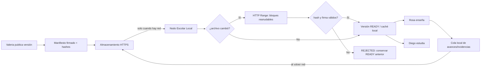
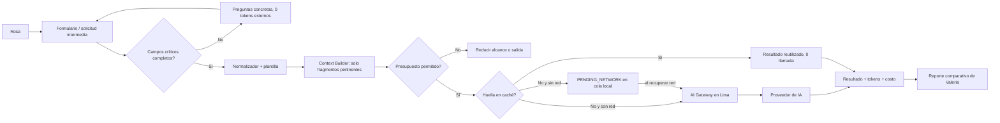

# R.E.D.A.L.E. — RemoteSchooly

La arquitectura resuelve dos restricciones independientes: las escuelas tienen Internet limitado y con cortes, y el costo de IA debe reducirse de forma demostrable. Los materiales se distribuyen exclusivamente por la red: el Nodo Escolar Local descarga diferencias en bloques reanudables, prioriza recursos esenciales y conserva la última versión válida. El uso de IA se controla con una solicitud intermedia antes de cualquier llamada al modelo.

Los enlaces de Excalidraw están en [Diagrams/](../Diagrams/README.md).

- El **problema 1** resuelve la distribución con Internet intermitente: PD-1 a PD-8, 36 casos. Sirve para explicar **qué ocurre**.
- El **problema 2** resuelve la gobernanza del gasto en IA: PD-9 a PD-12, 18 casos. Sirve para explicar **dónde se evita el gasto**.
- El Top Down Design, con tres iteraciones acumulativas, sirve para sustentar **por qué está diseñado así**.

## Iteraciones del diagrama

| Iteración | Qué demuestra | Qué se agrega |
| --- | --- | --- |
| #1 | El sistema como una sola caja: quién lo usa y qué promete. | Nada por dentro todavía. |
| #2 | Distribución offline-first sobre el Internet existente. | Manifiesto firmado, almacenamiento por rangos, Sync Agent por diferencias, verificación, activación atómica y cola de retorno idempotente. |
| #3 | Gobernanza de tokens. | Login, Clarification Gate, biblioteca de prompts versionada, presupuesto, caché, AI Gateway y ledger. |

Cada iteración conserva lo anterior; ninguna sustituye a la previa.

## R — Requerimientos

- `FR-DIS-01..13` cubren publicación de estado completo, resolución de los cuatro casos por archivo, reanudación, prioridad, verificación, cola idempotente, activación atómica, doble marca de tiempo, salto de versiones, planificación de ventana y gestión de espacio.
- `FR-AI-01..16` convierten un pedido libre en una solicitud concreta, limitada y medible: identidad, biblioteca de plantillas, aclaración sin costo, archivo intermedio acotado, caché por huella, doble presupuesto, cola con cuota reservada y reporte comparable.
- `NFR-NET-01..04` definen el comportamiento ante cortes, bajo ancho de banda y en horario de clase; `NFR-CAP-01/02` fijan el mínimo de disco por nodo y el umbral de alerta; `NFR-COST-01..04` hacen comprobable la reducción de costo y acotan qué tarea es comparable.

La trazabilidad completa está en [Requirements/](../3-Requerimientos/) y la evaluación en [Spec/Results.md](../5-Especificacion/Results.md).

## E — Estimaciones iniciales

Son supuestos de piloto, no hechos del enunciado; deben validarse antes de escalar.

| Variable | Supuesto |
| --- | ---: |
| Escuelas piloto | 20 |
| Paquete lógico por escuela | 3 GB máximo |
| Cambio semanal promedio | 300 MB |
| Ancho de banda disponible | 1 Mbps cuando hay conexión |
| Ventana acumulada de conexión | 2 h por día |
| Clientes LAN simultáneos por escuela | 30 |
| Solicitudes IA comparables | 30 por periodo de medición |
| Línea base por solicitud | 2,000 tokens |
| Meta Gateway por solicitud | ≤ 1,200 tokens; 40% menos |

Una sincronización de 300 MB a 1 Mbps tarda aproximadamente 40 minutos de transferencia efectiva; cabe en la ventana asumida y puede repartirse entre varios periodos sin reiniciar. No se intenta transferir otra vez el paquete de 3 GB si no cambió. Para IA, 30 tareas consumirían 60,000 tokens en la línea base; la meta es como máximo 36,000 tokens externos con Gateway. Es una meta de prueba, no un resultado aún obtenido.

## D — Diseñar el servicio

Se elige una plataforma modular de tres zonas:

1. **Central de Lima.** CMS curricular, publicador, almacenamiento HTTPS, API de sincronización, AI Gateway y base de datos.
2. **Internet limitado.** Es el único medio de distribución. Puede fallar; no es sustituido por transporte físico.
3. **Escuela.** Un Nodo Escolar Local mantiene una caché versionada y sirve la última versión `READY` por LAN/Wi-Fi a Rosa y Diego.

### Flujo de sincronización por red

El nodo guarda el índice de bloques validados. Si la red se cae, la transferencia pasa a `PAUSED`; cuando vuelve, solicita solo los rangos pendientes. La activación es atómica: no se mezcla una versión nueva parcial con la que está visible. La cola local de avances aplica identificadores idempotentes para que un reintento no duplique un evento.

### Flujo de IA optimizado

El archivo intermedio es la frontera de costo: conserva solo intención pedagógica y referencias a fragmentos, no una copia de toda la conversación. Un ejemplo concreto está en [Examples/solicitud-ia.example.json](Examples/solicitud-ia.example.json).

### Política de reformulación y aclaración

| Paso | Regla | Consumo externo |
| --- | --- | --- |
| Validar | Comprueba objetivo, grado, curso, tipo, duración y formato. | 0 tokens |
| Aclarar | Pregunta máximo tres datos faltantes. | 0 tokens |
| Normalizar | Quita saludos, repeticiones y contexto ya identificado por ID; rellena la plantilla. | 0 tokens |
| Seleccionar | Incluye solo fragmentos curriculares etiquetados y un límite de contexto. | 0 tokens |
| Presupuestar | Cuenta/estima tokens y bloquea excedentes antes de enviar. | 0 tokens |
| Encolar | Conserva la solicitud lista si no hay Internet. | 0 tokens |
| Generar | Invoca una vez al modelo con máximos de entrada/salida. | Tokens facturados |
| Reutilizar | Busca por huella de solicitud, versión y plantilla. | 0 tokens si hay hit |

### Identidad y biblioteca de prompts

El docente entra con su cuenta antes de tocar el formulario. El login no es un trámite: sin identidad no hay cuota por docente, ni consumo atribuible por escuela en el ledger, ni permiso para editar plantillas. Un pedido anónimo no se puede presupuestar ni auditar, y el reporte de reducción dejaría de ser comparable.

La sesión se resuelve **en el nodo**, no en Lima. El nodo mantiene una réplica de identidad y cuota de los docentes de su escuela, así Rosa puede entrar y trabajar durante un corte. El consumo hecho sin red queda pendiente y se reconcilia cuando la conexión vuelve; si el saldo local y el central discrepan, manda el de la central. Un login que dependiera de Lima rompería el diseño offline-first justo en el punto donde más se necesita.

El prompt tampoco vive en la pantalla del docente. Se guarda como **plantilla versionada** en una biblioteca: `prompt_id`, `version`, texto canónico, campos obligatorios, autor, estado y la versión curricular con la que nació. El Clarification Gate consulta esa plantilla para saber qué campos exige el tipo de recurso; no inventa las preguntas ni las pide al modelo.

### Reutilización de un prompt entre años (2026 → 2027)

| Qué se reutiliza | Qué se vuelve a resolver |
| --- | --- |
| El `prompt_id` y su texto canónico: el docente no reescribe el prompt, solo llena los campos. | Los fragmentos curriculares: se resuelven contra la versión vigente (`2027.1`), no contra los IDs congelados de 2026. |
| Los campos obligatorios y el presupuesto de la plantilla. | La huella de caché. |

La huella es `hash(prompt_id + version + valores de campos + IDs de fragmentos + modelo + curriculum_version)`. Como la versión curricular cambia de año, un resultado guardado en 2026 no se devuelve como si fuera de 2027: se regenera una vez y se vuelve a cachear. Si el currículo cambió de fondo, la coordinadora publica `worksheet-v2` y marca `worksheet-v1` como histórica; nunca se borra, porque se necesita para auditar en qué se gastó el presupuesto de 2026.

El efecto sobre el costo es doble: se reutiliza el trabajo caro —diseñar y probar el prompt—, y se evita reutilizar una respuesta que ya no corresponde al año.

## A — Modelo de datos

La fuente de verdad del piloto es una base relacional central y un almacén local en el nodo. La sincronización es eventual y explícita por versión; no se promete consistencia global en tiempo real durante un corte.

| Entidad | Campos relevantes |
| --- | --- |
| `content_packages` | `package_id`, `school_id`, `week`, `curriculum_version`, `manifest_hash`, `signature`, `status` |
| `package_files` | `package_id`, `path`, `sha256`, `size`, `priority`, `resource_type` |
| `download_blocks` | `package_id`, `file_hash`, `range_start`, `range_end`, `status`, `verified_at` |
| `sync_events` | `event_id`, `school_id`, `package_id`, `action`, `timestamp`, `result` |
| `outbox_events` | `event_id`, `school_id`, `type`, `payload_hash`, `status`, `idempotency_key` |
| `ai_requests` | `request_id`, `school_id`, `course`, `grade`, `normalized_request`, `template_version`, `status` |
| `context_chunks` | `chunk_id`, `curriculum_version`, `tags`, `content_hash`, `token_count` |
| `ai_generations` | `generation_id`, `request_hash`, `model`, `input_tokens`, `output_tokens`, `estimated_cost`, `cache_hit` |
| `token_baselines` | `task_id`, `model`, `curriculum_version`, `baseline_tokens`, `gateway_tokens`, `reduction_pct` |
| `users` | `user_id`, `role`, `school_id`, `courses`, `token_quota`, `status` |
| `prompt_templates` | `prompt_id`, `version`, `resource_type`, `canonical_text`, `required_fields`, `budget`, `born_curriculum_version`, `state`, `author_id`, `created_at` |

## L — Componentes

| Componente | Responsabilidad | Requisitos |
| --- | --- | --- |
| CMS y publicador | Versiona contenido, genera manifiesto, firma y publica por HTTPS. | `FR-DIS-01` |
| Almacenamiento HTTPS | Sirve manifiestos y archivos comprimidos con soporte de rangos. | `FR-DIS-02/03` |
| Sync Agent del nodo | Compara manifiestos, descarga diferencias, reanuda, verifica, activa por puntero y planifica la ventana. | `FR-DIS-02..05`, `FR-DIS-07/09/10/11` |
| Caché y catálogo local | Publica la última versión `READY` a la LAN/Wi-Fi. | `FR-DIS-04/05` |
| Cola local / Sync Outbox | Conserva y reintenta avances e incidencias con identificador congelado al crear; encola solicitudes de IA con la cuota reservada. | `FR-DIS-06/08`, `FR-AI-11` |
| Identidad y sesión | Autentica al docente contra una réplica local, expone rol, escuela, cursos y cuota, y reconcilia el consumo con la central al volver la red. | `FR-AI-09`, `FR-AI-13/14`, `NFR-SEC-01/02` |
| Formulario IA | Recoge intención con campos definidos. | `FR-AI-01` |
| Clarification Gate | Evalúa en orden plantilla, cuota y campos; formula preguntas concretas sin invocar al modelo. | `FR-AI-03` |
| Biblioteca de prompts | Versiona plantillas, marca la vigente del año y conserva las históricas. | `FR-AI-10` |
| Prompt Rewriter / Context Builder | Construye la solicitud y el prompt canónico mínimo. | `FR-AI-02/04` |
| Budget Guard y caché | Consulta la caché por huella antes de presupuestar; aplica topes de entrada y de salida y bloquea sin reintentar. | `FR-AI-05/06/12` |
| Medidor y reporte | Registra consumo y compara con baseline. | `FR-AI-07/08` |

## E — Escalar

1. **Piloto (20 escuelas):** un CMS central, almacenamiento HTTPS, una base de datos, un AI Gateway y un Nodo Local por escuela. La sincronización se programa fuera de horas de clase.
2. **Crecimiento regional:** usar CDN/replicas de solo lectura y limitar concurrencia por región; conservar descargas por diferencias y colas locales. Los workers de IA se separan solo si su carga lo exige.
3. **Cobertura nacional:** monitorear porcentaje de versiones `READY`, bytes reanudados, cortes y tiempo hasta sincronización. Rotar llaves y actualizar agentes de forma gradual.

## Decisión final y límites del POC

La arquitectura recomendada es un monolito modular central con almacenamiento HTTPS y un nodo local por escuela. Es la alternativa más sencilla para conectividad intermitente: usa la red existente, no reenvía datos ya recibidos y preserva continuidad de estudio con caché local. El POC debe demostrar descarga por rangos, corte/reanudación, activación íntegra, acceso a la última versión y el flujo de IA con medición comparable. No demostrará disponibilidad total, una conexión alternativa, rendimiento real de cada proveedor ni calidad pedagógica de producción.
