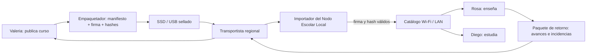
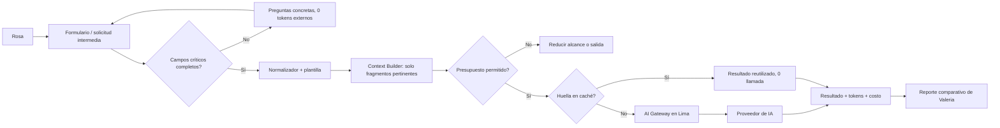

# R.E.D.A.L.E. — RemoteSchooly

La arquitectura parte de dos restricciones del caso: en la escuela remota no hay Internet y el costo de IA debe bajar de forma demostrable. Por eso se separan dos flujos: el contenido viaja en un medio físico hacia un nodo local; las solicitudes de IA viajan como datos estructurados hacia la central cuando corresponde. No se agrega satélite, red móvil, microservicios ni un sistema de mensajería distribuido para resolver un problema que el enunciado no plantea.

El diagrama editable es [01-topdown-remoteschooly.excalidraw](Diagrams/01-topdown-remoteschooly.excalidraw).

## R — Requerimientos

- `FR-DIS-01..06` aseguran que los materiales lleguen, sean verificables y puedan usarse sin Internet.
- `FR-AI-01..08` convierten un pedido libre en una solicitud concreta, limitada y medible.
- `NFR-OFF-01` y `NFR-INT-01/02` priorizan operación offline e integridad; `NFR-COST-01/02` hace comprobable la reducción de costo.

La trazabilidad completa está en [Requirements/](Requirements/) y la evaluación en [Spec/Results.md](Spec/Results.md).

## E — Estimaciones iniciales

Son supuestos de piloto, no hechos del enunciado; deben validarse antes de escalar.

| Variable | Supuesto |
| --- | ---: |
| Escuelas piloto | 20 |
| Paquetes por escuela | 1 por semana |
| Tamaño promedio del paquete optimizado | 3 GB |
| Material distribuido por semana | `20 × 3 GB = 60 GB` físicos |
| Clientes LAN simultáneos por escuela | 30 |
| Solicitudes IA comparables del piloto | 30 por periodo de medición |
| Línea base por solicitud | 2,000 tokens (1,200 entrada + 800 salida) |
| Meta Gateway por solicitud | ≤ 1,200 tokens; 40% menos |

Un nodo que sirva 30 clientes no necesita una infraestructura distribuida. El medio físico debe contener aproximadamente 3 GB por escuela más manifiesto y espacio de retorno. Para IA, 30 tareas consumirían 60,000 tokens en la línea base; la meta es como máximo 36,000 tokens externos con Gateway. Es una meta de prueba, no un resultado aún obtenido.

## D — Diseñar el servicio

Se elige una plataforma modular de tres zonas:

1. **Central de Lima.** CMS curricular, empaquetador, registro logístico, AI Gateway y base de datos. Es la única zona que puede comunicarse con el proveedor de IA.
2. **Transporte físico.** Medio sellado que lleva el paquete firmado; el trayecto de retorno lleva datos offline. No es una red ni ofrece Internet.
3. **Escuela sin Internet.** Nodo Escolar Local con catálogo y almacenamiento. Sirve contenido por LAN/Wi-Fi y no depende de una llamada a Lima.

### Flujo de distribución offline

La importación se ejecuta localmente. Si el manifiesto no valida, el paquete se rechaza y el nodo mantiene la última versión publicada. Esta decisión protege que llegue el curso correcto sin afirmar que se resolverá toda falla de logística.

### Flujo de IA optimizado

El archivo intermedio es la frontera de costo: conserva solo intención pedagógica y referencias a fragmentos, no una copia de toda la conversación. Un ejemplo concreto está en [Examples/solicitud-ia.example.json](Examples/solicitud-ia.example.json).

### Política de reformulación y aclaración

| Paso | Regla | Consumo externo |
| --- | --- | --- |
| Validar | Comprueba objetivo, grado, curso, tipo, duración y formato. | 0 tokens |
| Aclarar | Pregunta máximo tres datos faltantes: por ejemplo, “¿para qué grado?” | 0 tokens |
| Normalizar | Quita saludos, repeticiones y contexto ya identificado por ID; rellena la plantilla. | 0 tokens |
| Seleccionar | Incluye solo fragmentos curriculares etiquetados y un límite de contexto. | 0 tokens |
| Presupuestar | Cuenta/estima tokens y bloquea excedentes antes de enviar. | 0 tokens |
| Generar | Invoca una vez al modelo con máximos de entrada/salida. | Tokens facturados |
| Reutilizar | Busca por huella de solicitud, versión y plantilla. | 0 tokens si hay hit |

## A — Modelo de datos

La fuente de verdad del piloto es una base relacional central y una base/local store en el nodo. No se pretende una consistencia global en tiempo real: cada paquete tiene una versión explícita y se reconcilia físicamente.

| Entidad | Campos relevantes |
| --- | --- |
| `content_packages` | `package_id`, `school_id`, `week`, `curriculum_version`, `manifest_hash`, `signature`, `status` |
| `package_files` | `package_id`, `path`, `sha256`, `size`, `resource_type` |
| `custody_events` | `package_id`, `actor_id`, `action`, `timestamp`, `result` |
| `offline_returns` | `return_id`, `school_id`, `package_id`, `created_at`, `manifest_hash` |
| `ai_requests` | `request_id`, `school_id`, `course`, `grade`, `normalized_request`, `template_version`, `status` |
| `context_chunks` | `chunk_id`, `curriculum_version`, `tags`, `content_hash`, `token_count` |
| `ai_generations` | `generation_id`, `request_hash`, `model`, `input_tokens`, `output_tokens`, `estimated_cost`, `cache_hit` |
| `token_baselines` | `task_id`, `model`, `curriculum_version`, `baseline_tokens`, `gateway_tokens`, `reduction_pct` |

## L — Componentes

| Componente | Responsabilidad | Requisitos |
| --- | --- | --- |
| CMS y empaquetador | Selecciona contenido, crea manifiesto, firma y paquete físico. | `FR-DIS-01` |
| Registro de custodia | Registra despacho, recepción e instalación. | `FR-DIS-02` |
| Nodo Escolar Local | Verifica, versiona y sirve contenido por LAN/Wi-Fi. | `FR-DIS-03..06` |
| Cliente local | Catálogo de Rosa y Diego; no contiene enlaces ni llamadas remotas. | `FR-DIS-04/05` |
| Paquete de retorno | Encapsula avances e incidencias offline. | `FR-DIS-06` |
| Formulario IA | Recoge intención con campos definidos. | `FR-AI-01` |
| Clarification Gate | Detecta omisiones y formula preguntas concretas. | `FR-AI-03` |
| Prompt Rewriter / Context Builder | Construye la solicitud y el prompt canónico mínimo. | `FR-AI-02/04` |
| Budget Guard y caché | Aplica topes y evita invocaciones equivalentes. | `FR-AI-05/06` |
| Medidor y reporte | Registra consumo y compara con baseline. | `FR-AI-07/08` |

## E — Escalar

1. **Piloto (20 escuelas):** un CMS central, un empaquetador, una base de datos, un AI Gateway y un Nodo Local por escuela. Un catálogo local basta para 30 clientes.
2. **Crecimiento regional:** separar workers de empaquetado y generación IA, usar almacenamiento de objetos en Lima y un caché de resultados por plantilla/curso. El camino a la escuela continúa físico mientras esa sea la restricción.
3. **Cobertura nacional:** particionar operación por región y calendario de distribución; adoptar observabilidad logística y rotación de llaves. Solo se consideran servicios separados si los dominios o la carga lo justifican.

## Decisión final y límites del POC

La arquitectura recomendada es un monolito modular central más un nodo local independiente por escuela. Es la alternativa más sencilla que satisface el material offline, la integridad y el control de tokens. El POC debe demostrar ambos happy paths con WAN desconectada y con un conjunto comparable de solicitudes. No demostrará disponibilidad total, recuperación ante pérdida de medio, operación eléctrica, conectividad remota ni calidad pedagógica de producción.
